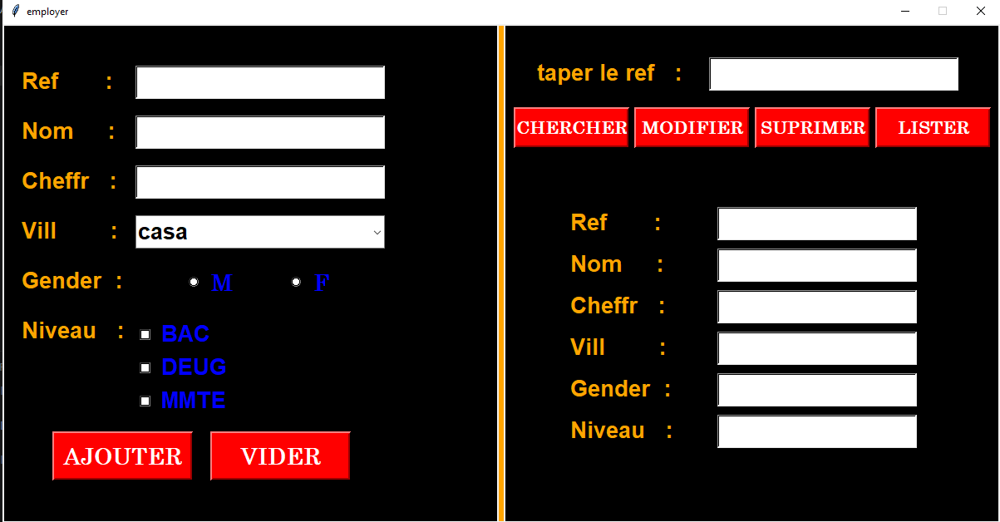

# Gestion des Employés (Employee Management System)

Un projet simple d'application de bureau (Desktop Application) développé avec Python et la bibliothèque Tkinter. Ce projet permet d'illustrer la manipulation de l'Interface Graphique (GUI) et l'utilisation de la Programmation Orientée Objet (POO) en Python.

## 🚀 Fonctionnalités
- **Ajouter (AJOUTER)** : Permet de créer un nouvel employé avec sa référence, nom, chiffre, ville, genre et niveau d'étude.
- **Chercher (CHERCHER)** : Recherche un employé par sa référence et confirme son existence.
- **Modifier (MODIFIER)** : Modifie les informations d'un employé existant.
- **Supprimer (SUPRIMER)** : Supprime un employé du système.
- **Lister (LISTER)** : Affiche les détails complets d'un employé sélectionné par sa référence.
- **Vider (VIDER)** : Réinitialise tous les champs du formulaire.

## 🛠️ Technologies Utilisées
- **Python 3.x**
- **Tkinter** : Bibliothèque standard de Python pour créer des interfaces graphiques.

## 📂 Structure du Code
- `classE.py` : Contient la classe `employer` avec ses attributs et méthodes (`__init__`, `getChiffr`, `setChiffr`).
- `fenE.py` : Contient l'interface graphique Tkinter (Labels, Entries, Buttons, Combobox, Radiobuttons, Checkbuttons) et la logique CRUD (Create, Read, Update, Delete) stockant les données dans une liste en mémoire.

## ⚙️ Comment Lancer le Projet

1. Assurez-vous d'avoir Python installé sur votre machine.
2. Clonez ce dépôt GitHub :
   ```bash
   git clone https://github.com/charaf12-u/gestion-des-emploiyer.git
   ```
3. Naviguez vers le dossier du projet :
   ```bash
   cd gestion-des-emploiyer
   ```
4. Exécutez le fichier principal :
   ```bash
   python fenE.py
   ```

## 📸 Capture d'Écran


---
*Ce projet est réalisé dans le cadre d'un apprentissage de Python (Tkinter et POO).*
